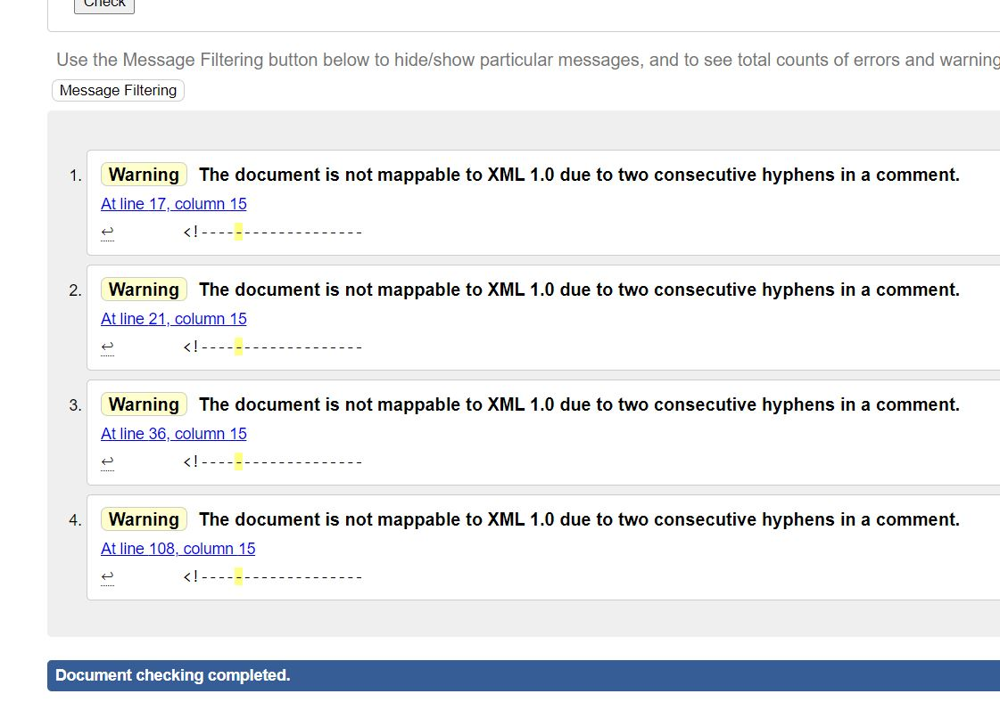

<!----------------------------------------Bannière---------------------------------------------->

<!----------------------------------------Sujet---------------------------------------------->

## Table des Matières ##

- [Titre de notre projet](#SAE-105-:-Création-d'un-site-web)
- [Auteurs du projet](#Auteurs-du-projet)
- [URL de notre site](#URL-de-notre-site-hébergé-sur-webetu)
- [Description du projet](#Description-de-notre-projet)
- [Arborescence de notre site](#Arboresence-de-notre-site)
- [Validation W3C](#Validation-W3C-du-code-de-chaque_page)
- [Éléments faits et manquants](#Éléments-faits-et-manquants)
- [Estimation de la note](Estimation-de-la-note)
- [Crédits](#Crédits)

# SAE 105 : Création d'un site web 

Projet SAE 105 : Création d'un site Web

## Auteurs du projet 

- **Alan WILHELM**

alan.wilhelm7@etu.univ-lorraine.fr

- **Sarah TERKOWSKY** 

sarah.terkowsky8@etu.univ-lorraine.fr

## URL de notre site hébergé sur webetu ##

Voici notre site: [Innov'Immo](https://webetu.iutnc.univ-lorraine.fr/~terkowsk6u/SAE105 "Innov'Immo")

## Description de notre projet ##

Pour ce qui est de notre projet, nous avons décidé de créer un site web d'une agence immobilière car nous étions tous les 2 intéressés par ce sujet et pensions que c'est original. 

## Arborescence de notre site ##

-[Page index](https://webetu.iutnc.univ-lorraine.fr/~terkowsk6u/SAE105) rélaisé par Sarah TERKOWSKY

-[Page Agences](https://webetu.iutnc.univ-lorraine.fr/~terkowsk6u/SAE105/agences.html) rélaisé par Alan WILHELM

-[Page Biens](https://webetu.iutnc.univ-lorraine.fr/~terkowsk6u/SAE105/biens.html) rélaisé par Sarah TERKOWSKY

-[Page Formulaire](https://webetu.iutnc.univ-lorraine.fr/~terkowsk6u/SAE105/formulaire.html) rélaisé par Alan WILHELM

-[Page A propos](https://webetu.iutnc.univ-lorraine.fr/~terkowsk6u/SAE105/apropos.html) rélaisé par Alan WILHELM

-[Page Erreur404](https://webetu.iutnc.univ-lorraine.fr/~terkowsk6u/SAE105/Erreur/erreur404.html) rélaisé par Sarah TERKOWSKY

-[Page Erreur403](https://webetu.iutnc.univ-lorraine.fr/~terkowsk6u/SAE105/Erreur/erreur403.html) rélaisé par Alan WILHELM

## Validation W3C du code de chaque page ##

Tous les Warning sont dû au commentaire dans le HTML, nous ne les avons pas corrigé car nous ne trouvons cela pas important. Cependant, toutes les pages HTML on été vérifié et validé.

* Page Index:

* Page Agences:

* Page Biens:

* Page Formulaire:

* Page A propos:

* Page Erreur404:

* Page Erreur403:

## Éléments faits et manquants

Ce que nous avons fait :

* Les deux pages statiques.
* Les deux pages dynamiques.
* Le formulaire qui est fonctionnel.
* Le CSS de chaque page.
* La distinction entre les images intégrés en HTML ou CSS
* Les médias sont optimisés, redimensionés.
* Les pages erreur 404 et 403
* La validation W3C
* Le commentaire des pages HTML et CSS
* Le logo fait sur illustrator ainsi que le flavicon

Ce qui manque :

* Le slider déborde sur du fond, nous n'avons pas pu régler ce problème.

## Estimation de la note ##

- **Sarah TERKOWSKY** : Je pense que notre travail mérite une note au-dessus de 15.

- **Alan WILHELM** : Je pense au moins avoir 15 au minimum avec tout le travail que nous avons réalisé et le temps que cela nous a prit.

## Crédits ##

Ce site nous a permis de choisir des images libre de droits : [Pexel](https://www.pexels.com/fr-fr/)
Ce site nous a permis à redimensionner les images : [Image Resizer](https://imageresizer.com/)

